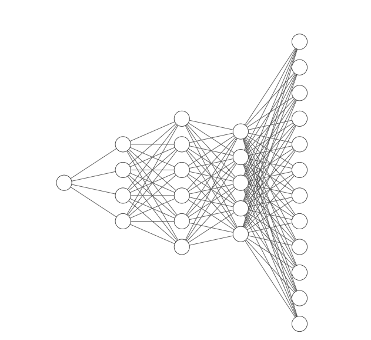
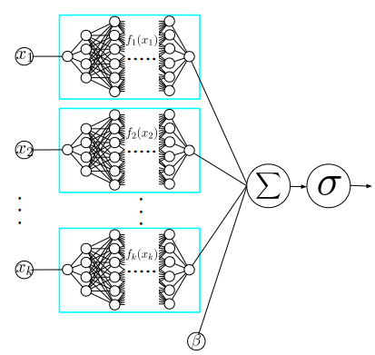

# mutitaskNAM
This github is an experiment based on the paper NAM: Neural Additive Models - Interpretable Machine Learning with Neural Nets
I want to try how it works with muti class setting. Like do classification on 200 class with 4000 data points.
This dataset is tested with decision tree and the accuracy is around 98%.

I changed the feature output of the NAM model to become mutiple outputs. And all outputs are added together. 
However it doesn't work well with extremely low accuracy. If anyone see if I did anything wrong please tell me. 
Hopefully this experiment can help someone. 

My feature network compared with the original one in blue rectangle. 

All nodes last layers of all features will be added together to achieve muticlass classification.

